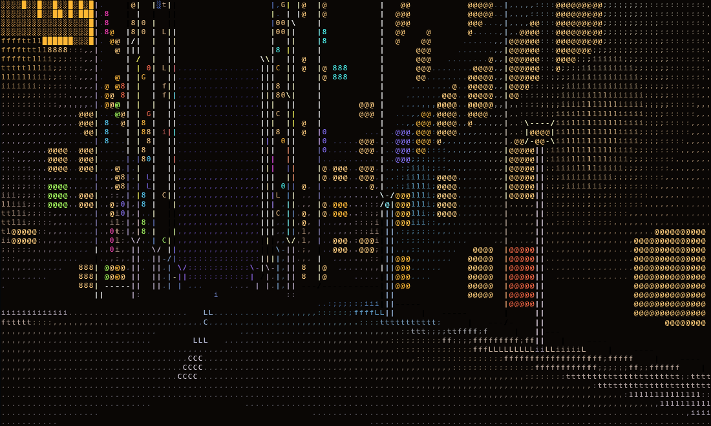
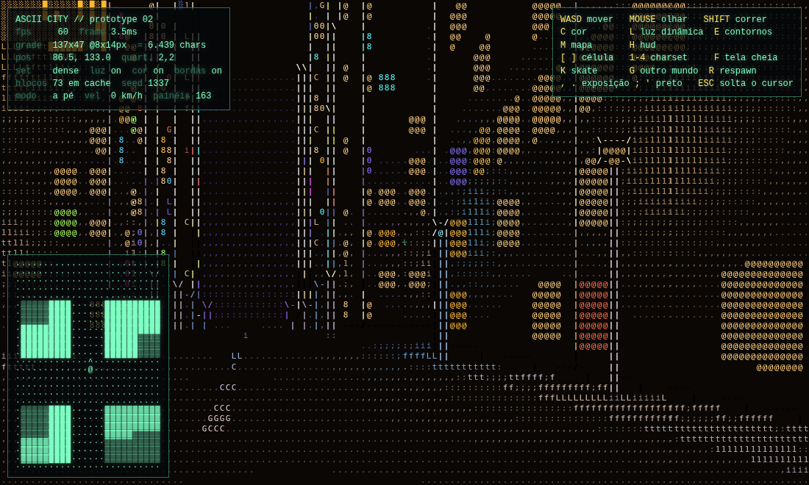
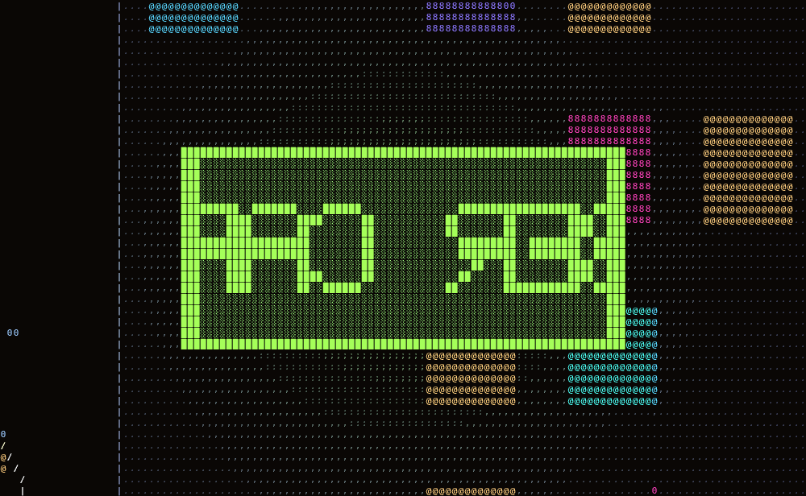
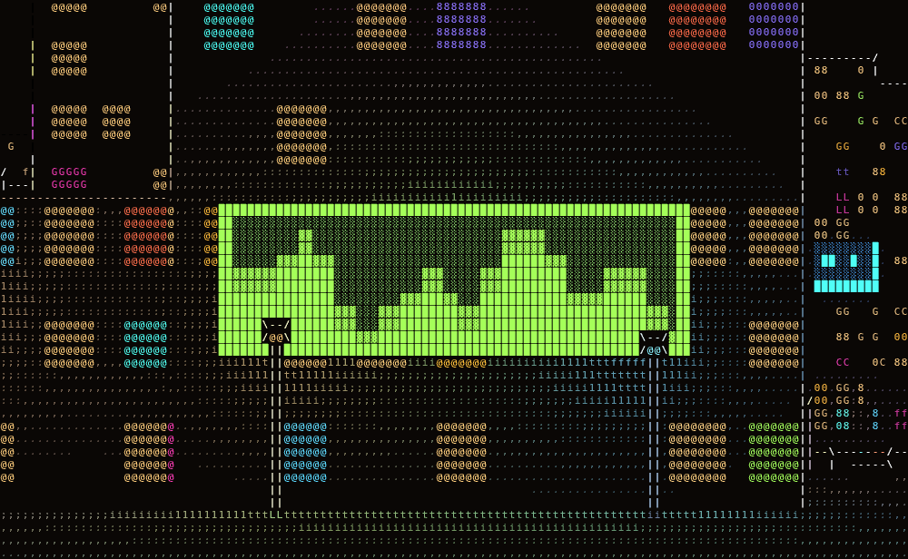
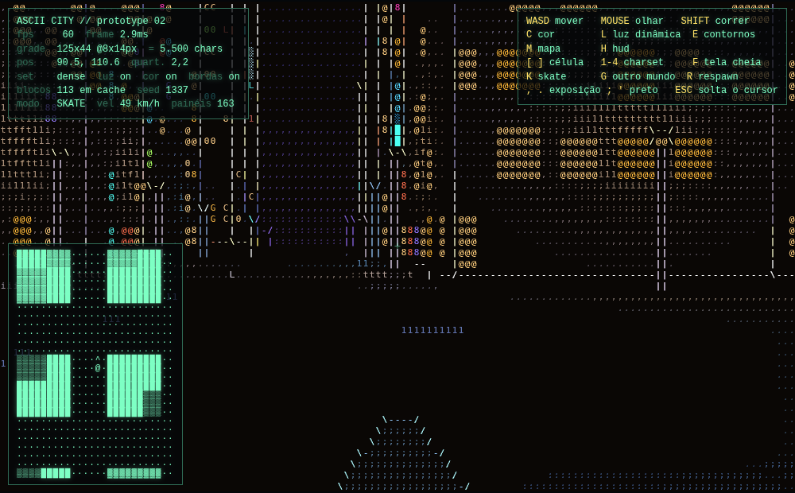
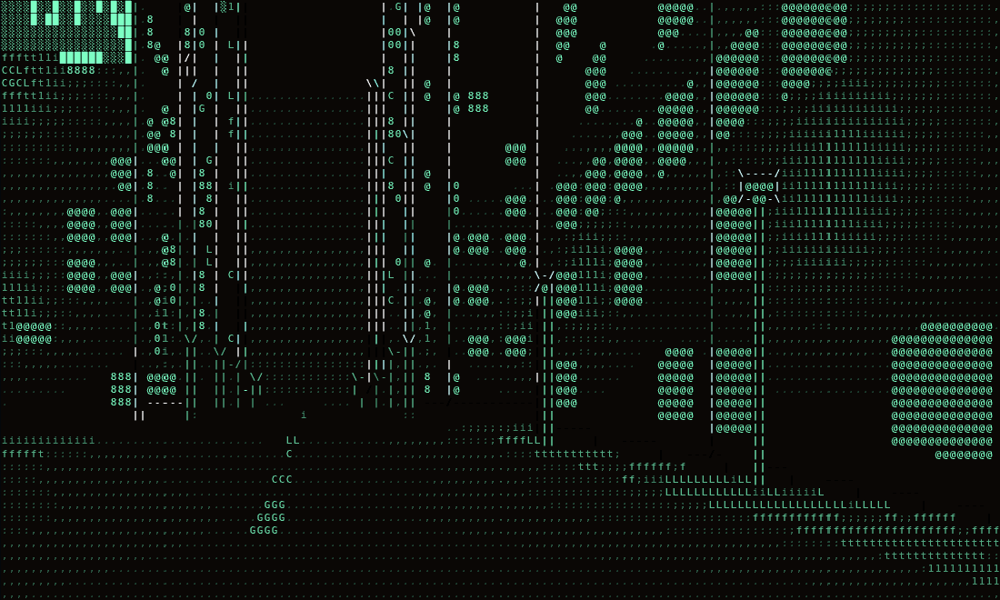
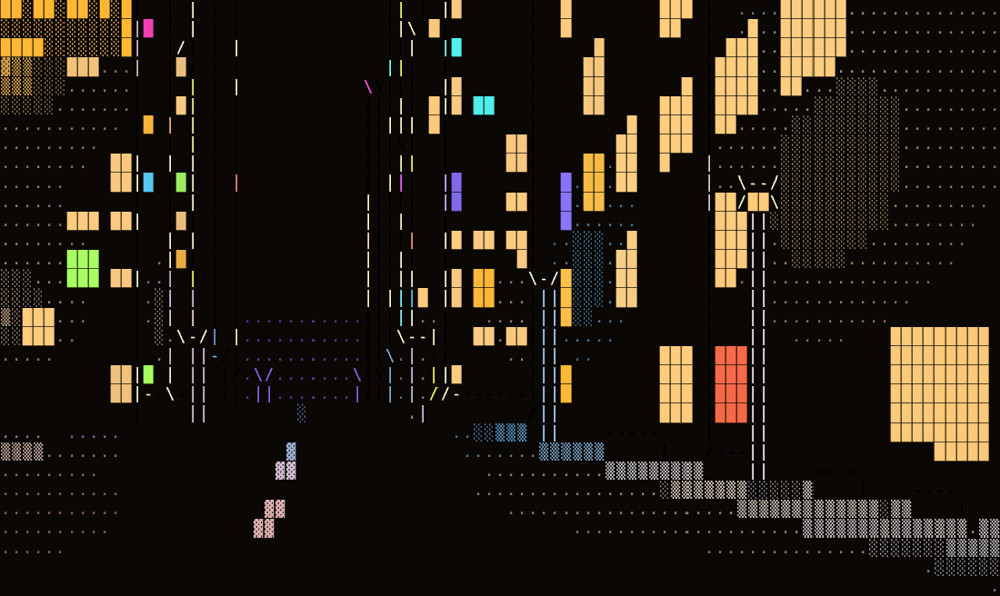

# ASCII CITY — protótipo de jogo 3D em ASCII

Um jogo de exploração em primeira pessoa numa metrópole cyberpunk **infinita**,
desenhado inteiramente com caracteres. Roda no navegador, em um único arquivo
HTML, sem dependências, sem build, sem servidor — e **sem WebGL**.



## Como rodar

Abra `index.html` no navegador (duplo clique funciona — o arquivo é
autocontido). Se preferir servir por HTTP:

```bash
cd ascii-city && python3 -m http.server 8000   # http://localhost:8000
```

## Controles

| Tecla | Ação |
|---|---|
| `W` `A` `S` `D` | andar |
| mouse | olhar (clique para capturar o cursor, `ESC` solta) |
| `SHIFT` | correr |
| `K` | pegar / largar o skate |
| `C` | cor ↔ mono | 
| `L` | liga/desliga a iluminação dinâmica |
| `E` | liga/desliga os contornos |
| `M` | minimapa · `H` HUD · `F` tela cheia |
| `[` `]` | tamanho do caractere (6×10 até 14×25 px) |
| `1` `2` `3` `4` | conjunto de caracteres |
| `G` | gera outro mundo · `R` respawn |
| `,` `.` | exposição · `;` `'` nível de preto |

## Nada de 3D por baixo

Esta é a diferença central em relação à primeira versão (que rasterizava a cena
em WebGL e convertia a imagem para texto num pós-processamento). Aqui **não
existe imagem intermediária**: o frame é escrito direto num buffer de
caracteres, como os engines de modo texto dos anos 90, e só no fim esse buffer
vira pixels.

O resultado é ~**3 ms por frame em renderização por software** (SwiftShader,
sem GPU nenhuma) contra ~55 ms da versão anterior.

```
   por coluna da tela
   ┌──────────────────────────────────────────────────────────┐
   │ DDA sobre a malha de 1 m, gerada sob demanda             │
   │   → registra cada face de parede exposta (h > h anterior)│
   │   → para quando uma parede já cobre o topo da tela       │
   ├──────────────────────────────────────────────────────────┤
   │ piso: floor casting (distância = eye·projV / (y-horiz))  │
   │ paredes: algoritmo do pintor, do fundo para a frente     │
   │ céu: gradiente + estrelas fixas em coordenada de mundo   │
   ├──────────────────────────────────────────────────────────┤
   │ sprites (postes, árvores) com z-test por coluna          │
   └──────────────────────────────────────────────────────────┘
   depois, sobre a grade inteira
   ┌──────────────────────────────────────────────────────────┐
   │ contornos: onde o id de superfície muda entre células    │
   │   vizinhas e a vizinha está mais longe → | - / \         │
   ├──────────────────────────────────────────────────────────┤
   │ blit: máscara do glifo (3 níveis) → ImageData            │
   └──────────────────────────────────────────────────────────┘
```

**Paredes de altura variável.** Um raycaster clássico só tem uma altura. Aqui a
malha guarda a altura de cada tile em metros, e o DDA registra uma face nova
sempre que a altura sobe em relação ao tile anterior — o que também expõe o
prédio alto que está atrás do baixo. As faces são desenhadas do fundo para a
frente, então a oclusão sai de graça. A marcha para assim que uma parede cobre
o topo da tela: nada atrás dela pode aparecer.

**Contornos geométricos, não Sobel.** A v1 procurava bordas na imagem. Aqui não
há imagem — há o z-buffer da própria grade de caracteres, mais um id de
superfície por célula (0 céu, 1 piso, um id estável por face de prédio, um por
sprite). Onde o id muda entre vizinhas e a vizinha está mais longe, o glifo vira
o traço da direção da descontinuidade. A silhueta é exata e custa uma varredura
da grade.

**O terminal.** Cada glifo é rasterizado uma vez num canvas de `cellW × cellH`,
e guardado como a lista dos seus pixels acesos com o nível de alfa quantizado em
3. Desenhar uma célula é percorrer só esses pixels escrevendo a cor já
pré-multiplicada num `Uint32Array` — sem `fillText` por célula, sem GPU.

## A cidade

Infinita nos quatro sentidos, determinística, e nada é guardado além dos
quarteirões próximos (o cache segura ~220 e descarta os mais antigos).



### O traçado

Segue como se desenha um plano viário de verdade:

- **A caixa da rua tem largura fixa** (12 m) em toda a cidade — é isso que dá a
  leitura de cidade planejada. O que varia é o miolo do quarteirão.
- **Os eixos de rua são uma sequência 1-D separável** em X e em Z:
  `eixo(i) = round(i·46 + ruído(i)·18)`. Como o jitter é menor que a média, a
  sequência é monotônica e cada eixo se calcula isolado, sem acumular desde a
  origem — é o que torna a malha infinita e ainda assim perfeitamente alinhada.
  Como os eixos são inteiros e a caixa é par, a rua mede exatos 12 m sempre.
- **A calçada** é uma faixa de 3 m medida para dentro do quarteirão, então toda
  esquina fecha certo.
- **O miolo é loteado por subdivisão binária recursiva** até cada lote ficar
  entre 9 e 19 m de testada. Os lotes se encostam: paredes geminadas, como num
  quarteirão real.

Verificado por teste sobre 256 quarteirões: **zero sobreposições e 100 % das
caixas de rua com exatamente 12 m**.

### O que é procedural

| | como |
|---|---|
| tamanho dos quarteirões | jitter no eixo de rua → 19 a 48 m de miolo |
| altura dos prédios | ruído de valor suave em coordenadas de quarteirão define o *distrito*; o lote varia em torno desse patamar; 7 % viram torre isolada, 10 % viram térreo comercial. Resultado medido: 1 a 24 andares, mediana 10 |
| loteamento | subdivisão binária com corte sorteado |
| postes | vão sorteado em [10 m, 15 m] e depois **corrigido** até caber de fato na faixa; altura em [4,2 m, 6,2 m]. Medido: menor distância real entre dois postes = 9,3 m |
| outdoors e telões | fachada que dá para a rua, posição, tamanho, cor, texto e animação |
| praças | 9 % dos quarteirões, com canteiros e arborização |

### Luz



Cada poste, outdoor e telão é uma luz pontual real. Para não testar todas contra
cada célula, elas entram numa grade uniforme cuja célula tem o tamanho do raio
máximo: varrer os 3×3 buckets em volta do ponto basta para pegar todas as luzes
que o alcançam. Cada célula de parede, piso ou sprite é sombreada com
`atenuação × N·L` — é isso que faz a poça de luz embaixo do poste e o clarão do
letreiro na fachada vizinha.



Os **outdoors** desenham o texto com uma fonte matricial 5×7 em blocos, como um
painel de LED: de perto dá para ler a mensagem passando, de longe vira um borrão
colorido — igual na rua. Os **telões** rodam um equalizador animado.

#### A luz do painel é a densidade do que ele está mostrando

Um painel não tem brilho fixo. A cada frame mede-se qual fração dele está de
fato acesa, e é isso que vira intensidade e alcance da luz:

- no **outdoor**, a tinta das letras que estão passando pela janela do painel —
  a fonte 5×7 sabe quantas das 35 subcélulas cada letra acende, então uma
  palavra gorda como `PACHINKO` clareia a calçada mais que o espaço entre
  palavras;
- no **telão**, a altura somada das barras do equalizador, que tem uma batida
  global — a tela inteira acende e apaga junta, e a fachada pulsa no ritmo;
- a moldura, sempre acesa, entra como um piso constante.

Cada região é pesada pelo brilho que ela realmente emite (`EM_FRAME`,
`EM_LETTER`, `EM_BAR`, `EM_OFF`), e as mesmas constantes desenham o painel e
medem a luz, então os dois nunca saem de sincronia.

Medido no protótipo: o *duty* de um telão oscila entre **0,17 e 0,44** e o de um
outdoor entre **0,10 e 0,23**. Num ponto da calçada a 7 m do painel, a
luminância vai de **0,48 a 0,81 (+69 %)** ao longo do ciclo, e a densidade média
de caracteres de todo o piso visível sobe **5,6 %** — a rua responde em texto ao
texto do letreiro.

## O skate



`K` pega e larga o skate. É **um pouco** mais rápido que correr — 13,6 m/s
contra 11,0 m/s, cerca de 24 % — mas o que muda de verdade é a inércia:

- demora a pegar velocidade e quase não perde sozinho: soltando o `W` você
  desliza por bem mais tempo do que a pé;
- `A` e `D` **fazem curva**, não caranguejo: empurram com 45 % da força, e a
  velocidade gira junto com o olhar sem perder módulo — é o que separa carve de
  patinar no gelo;
- `S` é freio: para, não dá ré;
- ao descer, o excesso de velocidade é cortado para a velocidade de corrida.

O shape aparece em primeira pessoa e **recebe a luz da rua como qualquer outra
superfície** — passa embaixo de um poste e acende junto. A remada levanta a
câmera e o shape uma linha, no ritmo do empurrão.

## Ajustes

Tudo em `CFG` (traçado urbano) e `TUNE` (mapeamento de luminância). Os quatro
conjuntos de caracteres e seis tamanhos de célula trocam em tempo real:




## Próximos passos

- interiores e elevadores
- carros e pedestres (sprites já têm z-test)
- manobras no skate (hoje só rola e freia)
- áudio e controles de toque
- ruas em diagonal / avenidas (hoje a malha é estritamente ortogonal)

## Histórico

A v1 usava WebGL2 com MRT, Sobel em luminância + normais, e composição de glifos
num shader — a técnica de "graphics to text" popularizada pelo Acerola. Está no
histórico do git, em `178d2b8`.
