# ASCII CITY — protótipo de jogo 3D em ASCII

Um jogo de exploração em primeira pessoa numa metrópole cyberpunk **infinita**,
desenhado inteiramente com caracteres. Roda no navegador, em um único arquivo
HTML, sem dependências, sem build, sem servidor — e **sem WebGL**.


## Como rodar

Abra `index.html` no navegador (duplo clique funciona — o arquivo é
autocontido). Se preferir servir por HTTP:

```bash
cd ascii-city && python3 -m http.server 8000   # http://localhost:8000
```

## A interface é o próprio jogo

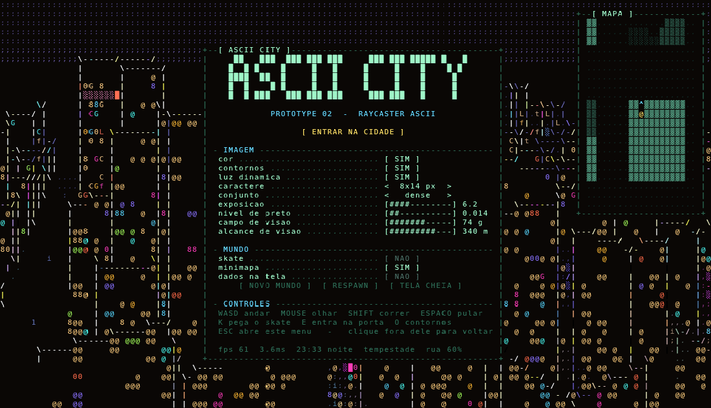

Não existe uma única borda, régua ou caixa de CSS no projeto. **O menu é
escrito nas mesmas células que o raycaster acabou de pintar** — molduras com
`+`, `-` e `|`, botões `[ ASSIM ]`, chaves `[ SIM ] / [ NAO ]`, seletores
`<  dense  >` e barras `[####--------]` — e o mouse é testado em coordenada de
célula, não em pixel. É uma TUI de terminal desenhada pelo mesmo blitter que
desenha a cidade, e a cidade continua rodando atrás dela.

Enquanto se joga **não há HUD nenhum**: a tela é só a cidade. `ESC` solta o
cursor e abre o menu; clicar em `[ RETOMAR ]` ou em qualquer ponto fora dos
painéis volta ao jogo.

Tudo que antes era atalho de teclado agora também é clicável e ajustável — os
atalhos continuam valendo como caminho rápido:

| Tecla | Ação |
|---|---|
| `W` `A` `S` `D` | andar |
| mouse | olhar |
| `SHIFT` | correr |
| `ESPAÇO` | pular (também no skate) |
| `K` | pegar / largar o skate |
| `ESC` | abre o menu |
| `C` | cor ↔ mono |
| `E` | entrar na porta / descer do telhado |
| `L` | luz dinâmica · `O` contornos · `M` minimapa |
| `[` `]` | resolução (célula de 4×7 até 14×25 px) |
| `1` `2` `3` `4` | conjunto de caracteres |
| `G` | outro mundo · `R` respawn · `F` tela cheia |
| `,` `.` | exposição · `;` `'` nível de preto |

O seletor **resolução** troca o tamanho da célula, de 14×25 px até 4×7 px, e
mostra a grade que sai daí. Célula menor é mais caractere na mesma tela, e mais
caractere é imagem mais fina — é literalmente aumentar a resolução do monitor,
e custa quadro na mesma proporção (medido em renderização por software, sem
GPU nenhuma, numa janela de 1600×900):

| célula | grade | células | ms/quadro |
|---|---|---|---|
| 14×25 | 114×36 | 4 104 | 4,2 |
| 12×21 | 133×42 | 5 586 | 5,1 |
| 10×17 | 160×52 | 8 320 | 6,7 |
| 8×14 (padrão) | 200×64 | 12 800 | 9,3 |
| 7×12 | 228×75 | 17 100 | 12 |
| 6×10 | 266×90 | 23 940 | 15 |
| 5×9 | 320×100 | 32 000 | 20 |
| 4×7 | 400×128 | 51 200 | 26 |

Chegar nesses números pedia duas otimizações, porque na densidade máxima o
quadro custava o triplo disso. A **curva de tom virou tabela**: exposição, gama
e rampa são fixas dentro do quadro, então o `exp` e o `pow` por célula viraram
uma consulta. E a **luz do piso passou a ter memória**: perto do observador
dezenas de linhas caem dentro do mesmo palmo de chão, e refazer a varredura de
luzes em cada uma era o maior custo do quadro — agora ela só é refeita quando o
ponto andou mais de 35 cm.

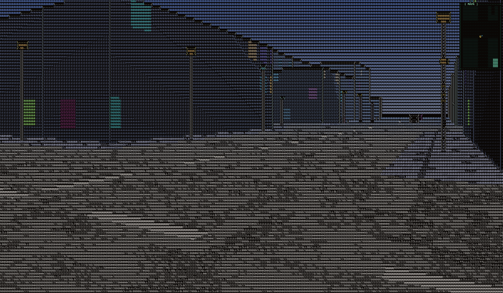

O menu também traz duas barras contínuas:

- **campo de visão, de 0 a 120 graus.** O valor efetivo é limitado a 1 grau no
  mínimo: em 0 a projeção seria um zoom infinito. E o campo **vertical** tem
  teto de 70°: num pinhole ele vem junto com o horizontal, e a 120° isso dava
  90° na vertical — metade da tela virava chão, e o pouco de mundo que sobrava
  na metade de baixo ficava esticado sobre metade das linhas. Andando e olhando
  para baixo era isso que virava borrão. Acima do teto, o que a barra abre vai
  só para os lados — é o "Hor+" dos jogos. Medindo o gradiente de graus por
  linha entre o topo e a base da tela, olhando 49° para baixo: a 74° de campo dá
  2,3×, a 120° dava **5,3×** e hoje dá **3,5×**. O preço é um esmagamento
  anamórfico leve, que numa grade de caracteres não se vê.
- **alcance de visão, de 60 a 420 m.** É a distância em que a marcha de cada
  raio para, e também a escala da névoa — aumentar mostra a cidade de longe, com
  os arranha-céus do fundo aparecendo inteiros. Como cada quarteirão só é gerado
  quando um raio o alcança, o teto do cache acompanha a barra (220 quarteirões
  até 140 m, 380 até 200 m, 620 acima disso), senão a cidade distante seria
  regerada a cada quadro.

Puxar o alcance de 60 para 420 m quase não custa quadro — medido girando 360°
na rua: 5,1 ms a 140 m, 4,6 ms a 220 m, 4,7 ms a 420 m. É a própria cidade que
paga a conta: no nível da calçada quase todo raio bate num prédio antes dos
50 m, então a marcha para no mesmo lugar. A diferença aparece de cima de um
telhado, onde os raios de fato viajam.

Os widgets são de modo imediato: cada um se desenha e, no mesmo passo, testa se
o mouse está em cima e se houve clique. Trocar o tamanho da célula realoca os
buffers, então o `resize` é adiado para depois do `blit` — senão o menu
terminaria de se desenhar em cima de um buffer que já não existe.

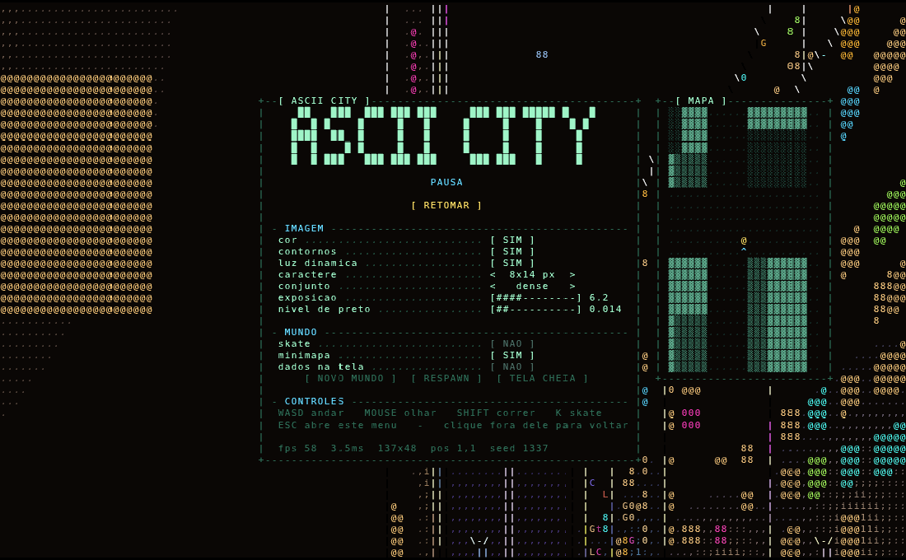

## Nada de 3D por baixo

Esta é a diferença central em relação à primeira versão (que rasterizava a cena
em WebGL e convertia a imagem para texto num pós-processamento). Aqui **não
existe imagem intermediária**: o frame é escrito direto num buffer de
caracteres, como os engines de modo texto dos anos 90, e só no fim esse buffer
vira pixels.

O resultado é ~**3 ms por frame em renderização por software** (SwiftShader,
sem GPU nenhuma) contra ~55 ms da versão anterior.

```
   por coluna da tela
   ┌──────────────────────────────────────────────────────────┐
   │ DDA sobre a malha de 1 m, gerada sob demanda             │
   │   → registra cada face de parede exposta (h > h anterior)│
   │   → para quando uma parede já cobre o topo da tela       │
   ├──────────────────────────────────────────────────────────┤
   │ chão e telhados: marcha de superfície sobre os mesmos  │
   │   passos do DDA, do perto para o longe, com marca d'água│
   │ paredes: algoritmo do pintor, do fundo para a frente     │
   │ céu: gradiente + estrelas fixas em coordenada de mundo   │
   ├──────────────────────────────────────────────────────────┤
   │ sprites (postes, árvores) com z-test por coluna          │
   └──────────────────────────────────────────────────────────┘
   depois, sobre a grade inteira
   ┌──────────────────────────────────────────────────────────┐
   │ contornos: onde o id de superfície muda entre células    │
   │   vizinhas e a vizinha está mais longe → | - / \         │
   ├──────────────────────────────────────────────────────────┤
   │ blit: máscara do glifo (3 níveis) → ImageData            │
   └──────────────────────────────────────────────────────────┘
```

**Paredes de altura variável.** Um raycaster clássico só tem uma altura. Aqui a
malha guarda a altura de cada tile em metros, e o DDA registra uma face nova
sempre que a altura sobe em relação ao tile anterior — o que também expõe o
prédio alto que está atrás do baixo. As faces são desenhadas do fundo para a
frente, então a oclusão entre paredes sai de graça. A marcha para assim que uma
parede cobre o topo da tela: nada atrás dela pode aparecer.

O pintor resolve parede contra parede, mas o chão é pintado antes e não entrava
na conta — e os sprites testavam profundidade por **coluna**, contra a parede
mais próxima dela, nunca contra o piso. No nível da rua isso nunca aparecia: com
o olho a 1,7 m, a base de uma parede a 40 m cai logo abaixo do horizonte e a
parede ocupa uma faixa fina da tela. De cima de um prédio o olho está a 77 m, a
base da mesma parede cai muito abaixo da tela, e ela passava a pintar a coluna
inteira — por cima da laje em que se estava pisando; um poste da rua lá embaixo
fazia o mesmo. Hoje parede e sprite fazem z-test **por célula** contra o que já
está lá. O sprite tem 15 cm de folga, senão se recortaria contra o próprio chão
onde pisa, que está exatamente à mesma distância dele. Medido nas 8 linhas de
baixo, de cima de um prédio de 76 m: eram 748 células de parede furando a laje,
hoje são 0 em qualquer inclinação.

**Chão e telhados na mesma marcha.** Um raycaster de modo texto normalmente
desenha o piso por *floor casting*: para cada linha abaixo do horizonte, a
distância sai de `eye·projV / (y − horizonte)`. A conta pressupõe **um único
plano em y = 0** — e por isso o teto de um prédio simplesmente não existe. Aqui
o DDA guarda cada passo que deu (distância e altura do tile), e o chão é
desenhado percorrendo esses passos **do perto para o longe**: cada tile pinta a
faixa da sua própria laje, com a linha `y` resolvida contra a altura *daquele*
tile, e uma marca d'água guarda até onde a coluna já foi preenchida para o
próximo trecho não repintar o que ficou na frente. A marcha para quando um tile
é mais alto que o olho — dali para frente é parede, não superfície.

É a mesma travessia que já existia, lida duas vezes, então o custo por coluna
praticamente não muda. E é isso que torna o telhado um lugar de verdade: subir
num prédio de 76 m e olhar para baixo devolve 1,2 m de distância na base da
tela, não os 56 m que a fórmula do plano único devolvia.

**A vertical é um cisalhamento.** O pitch não gira a câmera: desloca a linha
do horizonte em `tan(pitch)·projV` e deixa o resto da conta linear. Isso não é
uma aproximação — é a perspectiva correta com o ponto principal fora do centro,
como uma lente tilt-shift: reta do mundo continua reta na tela. O preço é que a
tangente cresce sem limite, então o pitch para em ±49°, antes de o esticamento
tomar conta.

Chegou a existir aqui uma vertical **cilíndrica**, em que a linha da tela era um
ângulo em vez de um deslocamento. Ela não tem singularidade e ia a ±83°, o que
parecia resolver o problema de subir num prédio e não poder olhar para baixo.
Não resolveu: uma projeção cilíndrica não consegue representar o ponto a pino.
Perto do extremo o nadir deixa de ser um ponto e vira uma linha esticada pela
tela inteira, e as horizontais do mundo entortam. A distorção que ela introduzia
era pior que o limite que removia, então voltou o cisalhamento.

O que ficou dessa passagem é a tabela: cada linha guarda a sua tangente uma vez
por quadro, e a marcha de superfície anda por ela em vez de resolver a linha por
conta a cada passo.

**Contornos geométricos, não Sobel.** A v1 procurava bordas na imagem. Aqui não
há imagem — há o z-buffer da própria grade de caracteres, mais um id de
superfície por célula (0 céu, 1 piso, um id estável por face de prédio, um por
sprite). Onde o id muda entre vizinhas e a vizinha está mais longe, o glifo vira
o traço da direção da descontinuidade. A silhueta é exata e custa uma varredura
da grade.

**O terminal.** Cada glifo é rasterizado uma vez num canvas de `cellW × cellH`,
e guardado como a lista dos seus pixels acesos com o nível de alfa quantizado em
3. Desenhar uma célula é percorrer só esses pixels escrevendo a cor já
pré-multiplicada num `Uint32Array` — sem `fillText` por célula, sem GPU.

## A cidade

Infinita nos quatro sentidos, determinística, e nada é guardado além dos
quarteirões próximos (o cache segura ~220 e descarta os mais antigos).

### O traçado

Segue como se desenha um plano viário de verdade:

- **A caixa da rua tem largura fixa** (12 m) em toda a cidade — é isso que dá a
  leitura de cidade planejada. O que varia é o miolo do quarteirão.
- **Os eixos de rua são uma sequência 1-D separável** em X e em Z:
  `eixo(i) = round(i·46 + ruído(i)·18)`. Como o jitter é menor que a média, a
  sequência é monotônica e cada eixo se calcula isolado, sem acumular desde a
  origem — é o que torna a malha infinita e ainda assim perfeitamente alinhada.
  Como os eixos são inteiros e a caixa é par, a rua mede exatos 12 m sempre.
- **A calçada** é uma faixa de 3 m medida para dentro do quarteirão, então toda
  esquina fecha certo.
- **O miolo é loteado por subdivisão binária recursiva** até cada lote ficar
  entre 9 e 19 m de testada. Os lotes se encostam: paredes geminadas, como num
  quarteirão real.

Verificado por teste sobre 256 quarteirões: **zero sobreposições e 100 % das
caixas de rua com exatamente 12 m**.

### Formatos de quarteirão

A caixa da rua e a calçada são as mesmas em toda a cidade — o que varia é o
**miolo**. Cada quarteirão sorteia um formato, e todos trabalham dentro do lote,
então o plano viário nunca é violado:

| formato | o que é |
|---|---|
| `grid` | loteamento retangular por subdivisão binária |
| `torre` | torre cilíndrica escalonada no meio, praça verde em volta, baliza piscando no topo |
| `cunha` | uma diagonal corta o quarteirão em dois triângulos: um alto, um baixo |
| `patio` | anel de prédios em volta de um pátio interno arborizado |
| `vila` | **rua sem saída**: um ramal entra do meio de uma testada e termina num balão de retorno, com casas baixas em volta |
| `praca` | canteiros baixos e árvores |

Torre e rua sem saída em planta (`@`/`O`/`o` prédio por altura, `.` rua,
`,` ramal sem saída, `"` verde, espaço calçada):

```
....                                                  ....
....                                                  ....
....   """""""""""""""""""OOOOOO"""""""""""""""""""   ....
....   """""""""""""""OOOOOOOOOOOOOO"""""""""""""""   ....
....   """""""""""""OOOO@@@@@@@@@@OOOO"""""""""""""   ....
....   """"""""""""OOO@@@@@@@@@@@@@@OOO""""""""""""   ....
....   """"""""""""OO@@@@@@@@@@@@@@@@OO""""""""""""   ....
....   """""""""""OOO@@@@@@@@@@@@@@@@OOO"""""""""""   ....
....   """"""""""""OO@@@@@@@@@@@@@@@@OO""""""""""""   ....
....   """"""""""""OOO@@@@@@@@@@@@@@OOO""""""""""""   ....
....   """""""""""""OOOO@@@@@@@@@@OOOO"""""""""""""   ....
....   """""""""""""""OOOOOOOOOOOOOO"""""""""""""""   ....
....   """""""""""""""""""OOOOOO"""""""""""""""""""   ....
....                                                  ....
....                                                  ....
```

```
....   OOOOOOOOOOOOOOOooooooooooooOOOOOOOOOOOOOOOOO   ....
....   OOOOOOOOOOOOOOOoooo      ooOOOOOOOOOOOOOOOOO   ....
....   OOOOOOOOOOOOOOOoo ,,,,,,,, OOOOOOOOOOOOOOOOO   ....
....   OOOOOOOOOOOOOOOo ,,,,,,,,,, OOOOOOOOOOOOOOOO   ....
....   OOOOOOOOOOOOOOOo ,,,,,,,,,, OOOOOOOOOOOOOOOO   ....
....   OOOOOOOOOOOOOOOo ,,,,,,,,,, OOOOOOOOOOOOOOOO   ....
....   OOOOOOOOOOOOOOOoo  ,,,,,,  OOOOOOOOOOOOOOOOO   ....
....   OOOOOOOOOOOOOOOoooo,,,,,,ooooooooooooooooooo   ....
....   OOOOOOOOOOOOOOOoooo,,,,,,ooooooooooooooooooo   ....
....   OOOOOOOOOOOOOOOoooo,,,,,,ooooooooooooooooooo   ....
....   OOOOOOOOOOOoooooooo,,,,,,ooooooooooooooooooo   ....
....   OOOOOOOOOOOoooooooo,,,,,,ooooooooooooooooooo   ....
....   OOOOOOOOOOOoooooooo,,,,,,ooooooooooooooooooo   ....
....   OOOOOOOOOOOoooooooo,,,,,,ooooooooooooooooooo   ....
....   OOOOOOOOOOOoooooooo,,,,,,ooooooooooooooooooo   ....
....   OOOOOOOOOOOoooooooo,,,,,,ooooooooooooooooooo   ....
....   OOOOOOOOOOOoooooooo,,,,,,ooooooooooooooooooo   ....
....                      ,,,,,,                      ....
```

Verificado em 256 quarteirões com todos os formatos ativos: **zero
sobreposições e 100 % das caixas de rua com exatamente 12 m**.

### O que é procedural

| | como |
|---|---|
| tamanho dos quarteirões | jitter no eixo de rua → 19 a 48 m de miolo |
| altura dos prédios | ruído de valor suave em coordenadas de quarteirão define o *distrito*; o lote varia em torno desse patamar; 7 % viram torre isolada, 10 % viram térreo comercial. Resultado medido: 1 a 24 andares, mediana 10 |
| loteamento | subdivisão binária com corte sorteado |
| postes | vão sorteado em [10 m, 15 m] e depois **corrigido** até caber de fato na faixa; altura em [4,2 m, 6,2 m]. Medido: menor distância real entre dois postes = 9,3 m |
| outdoors e telões | fachada que dá para a rua, posição, tamanho, cor, texto e animação |
| praças | 9 % dos quarteirões, com canteiros e arborização |

### Chão

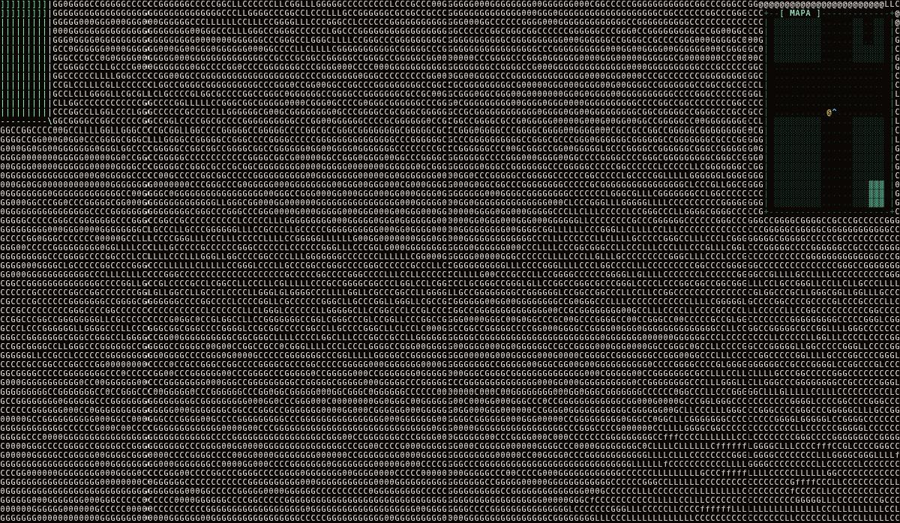

O chão era liso: um valor por tile de 1 m, e o asfalto um valor só. Numa grade
de caracteres isso vira um bloco chapado — e à noite, com a luminância abaixo do
nível de preto, virava **nada**: telhado e calçada sumiam de vez quando se subia
num prédio ou num canteiro. Hoje cada superfície horizontal tem material próprio:

| superfície | o que a compõe |
|---|---|
| asfalto | agregado fino, remendos largos e a faixa central tracejada |
| calçada | placas de 2 m com junta, cada placa com o seu tom, grão de concreto |
| grama | tufo curto sobre uma variação larga de canteiro |
| laje | manta asfáltica em faixas de 3 m, brita por cima, tom por prédio |
| sebe | topo do canteiro da praça, que também se sobe |

Duas coisas fazem isso funcionar numa tela de caracteres:

- **O grão é multiplicativo, não somado.** Uma amplitude fixa dá textura ao
  meio-dia e nada à noite, porque lá embaixo na curva de tom a rampa quase não
  tem degraus para gastar. Como fator, o mesmo contraste relativo sobrevive em
  qualquer luz.
- **A oitava fina segue a distância.** Olhando o próprio pé, um caractere cobre
  menos de um centímetro de chão; no fundo da rua cobre metros. Uma escala só
  vira bloco chapado de um lado e chiado piscante do outro, então a frequência
  é escolhida por distância, para dar ~2 células de tela por célula de grão. O
  ruído continua indexado em coordenada de **mundo**, e as oitavas são travadas
  em potências de 2 — ruído que acompanha a câmera continuamente "nada" na tela,
  que foi exatamente o que estourou a copa das árvores um dia.

Junto vieram dois acertos de conta. `%` em JavaScript guarda o sinal, então
`(wx*0.5) % 1` é negativo no lado negativo do mundo: metade da cidade caía
inteira dentro da junta da calçada, com a faixa da rua contínua em vez de
tracejada. E o brilho de céu de cidade (o `amb`, que pesa por quanto a
superfície olha para cima) subiu à noite — sem ele o asfalto ficava abaixo do
nível de preto e era recortado para o vazio. Medido em degraus de rampa (de 15):
o piso noturno saía em 0 — literalmente branco — e hoje sai em 2,8 longe de
poste, 7,1 embaixo de um, e 11 à tarde.

### Luz


Cada poste, outdoor e telão é uma luz pontual real. Para não testar todas contra
cada célula, elas entram numa grade uniforme cuja célula tem o tamanho do raio
máximo: varrer os 3×3 buckets em volta do ponto basta para pegar todas as luzes
que o alcançam. Cada célula de parede, piso ou sprite é sombreada com
`atenuação × N·L` — é isso que faz a poça de luz embaixo do poste e o clarão do
letreiro na fachada vizinha.


Os painéis vêm em três tipos. Os **outdoors** desenham o texto com uma fonte
matricial 5×7 em blocos, como um painel de LED: de perto dá para ler a mensagem
passando, de longe vira um borrão colorido — igual na rua. Os **telões** rodam
um equalizador animado. E os **painéis de arte** rodam peças de arte ASCII de
verdade, trocando a cada nove segundos, com o painel apagando na troca — a arte
foi desenhada para célula de terminal, então é reescalada com a proporção certa
para não sair achatada.

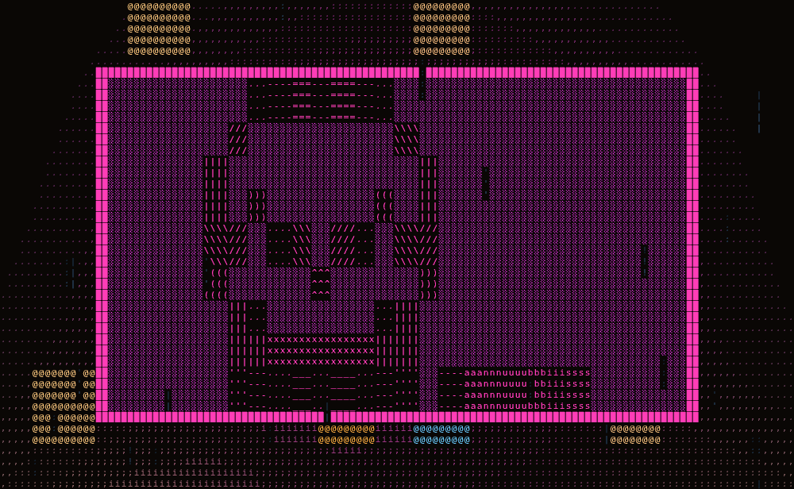

#### A luz do painel é a densidade do que ele está mostrando

Um painel não tem brilho fixo. A cada frame mede-se qual fração dele está de
fato acesa, e é isso que vira intensidade e alcance da luz:

- no **outdoor**, a tinta das letras que estão passando pela janela do painel —
  a fonte 5×7 sabe quantas das 35 subcélulas cada letra acende, então uma
  palavra gorda como `PACHINKO` clareia a calçada mais que o espaço entre
  palavras;
- no **telão**, a altura somada das barras do equalizador, que tem uma batida
  global — a tela inteira acende e apaga junta, e a fachada pulsa no ritmo;
- a moldura, sempre acesa, entra como um piso constante.

Cada região é pesada pelo brilho que ela realmente emite (`EM_FRAME`,
`EM_LETTER`, `EM_BAR`, `EM_OFF`), e as mesmas constantes desenham o painel e
medem a luz, então os dois nunca saem de sincronia.

Medido no protótipo: o *duty* de um telão oscila entre **0,17 e 0,44** e o de um
outdoor entre **0,10 e 0,23**. Num ponto da calçada a 7 m do painel, a
luminância vai de **0,48 a 0,81 (+69 %)** ao longo do ciclo, e a densidade média
de caracteres de todo o piso visível sobe **5,6 %** — a rua responde em texto ao
texto do letreiro.

## Gente e trânsito

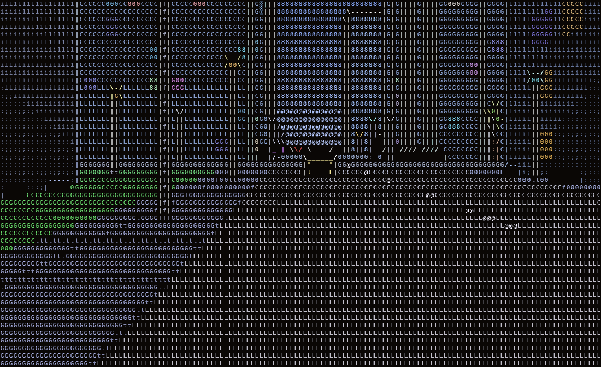

Pedestres e carros são sprites de arte ASCII desenhados como os letreiros: a
peça é reescalada para o tamanho real do corpo ou do veículo e recortada célula
a célula, com z-test por coluna e iluminação do lugar — quem passa debaixo de um
poste acende junto.

**Pedestres andam exclusivamente na calçada.** Cada um percorre o anel de
calçada de um quarteirão, parametrizado pelo perímetro: não existe um caminho
que os leve ao asfalto. A densidade segue o relógio da cidade:

| horário | densidade |
|---|---|
| 08:00 – 12:00 | média (55 %) |
| 12:01 – 19:00 | cheia (100 %) |
| 19:01 – 24:00 | cai um pouco (60 %) |
| 00:01 – 07:59 | bem raro (8 %) |

Cada tipo tem sua janela: o **bêbado** só aparece de madrugada, é raro e é o
único que não anda (fica oscilando no lugar); o **noturno** só entre 19:01 e
07:59; o **executivo** e o **vestido** somem de madrugada; os outros dois
circulam a qualquer hora.

**Carros andam exclusivamente no asfalto.** Cada um mora num eixo viário, numa
das duas mãos — toda rua é ida e volta —, a 20-30 km/h. Não colidem: cada carro
olha uma janela de 14 m à frente e freia por quem estiver nela, o que resolve
tanto a fila quanto o cruzamento, porque o carro que entra no cruzamento aparece
nessa janela. Para o jogador o carro é sólido. A frota é proporcional à gente na
rua.

A peça muda com o ângulo de quem olha: frente, traseira ou lateral (espelhada
conforme o lado).

Verificado com 30 pedestres e 18 carros ativos: **zero pedestres fora da
calçada, zero carros fora do asfalto e zero sobreposições entre carros**.

## Ciclo do dia e clima

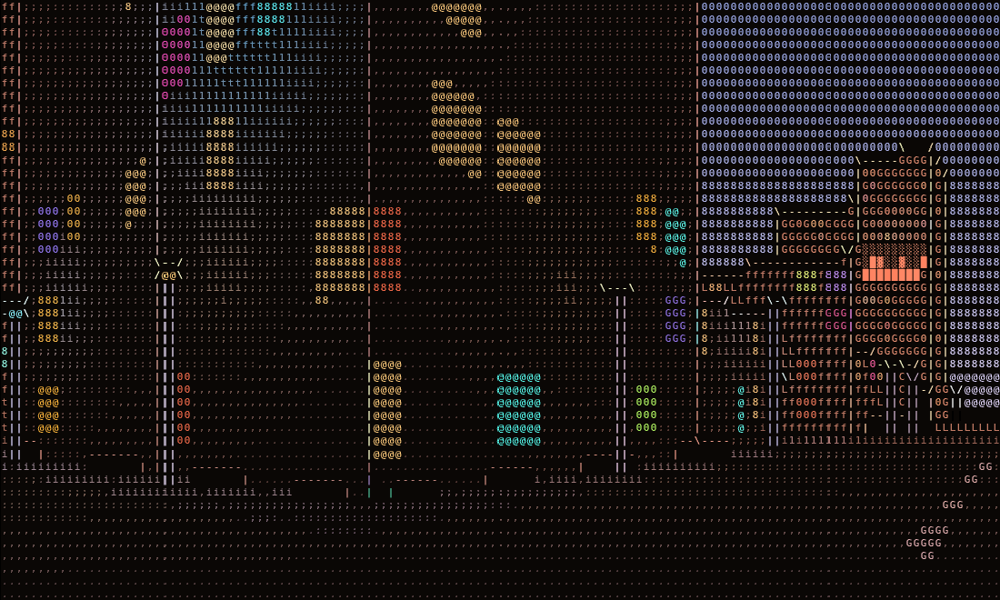

Uma volta completa leva **10 minutos**. Tudo que descreve o ambiente vem de
quadros-chave interpolados — céu (zênite e horizonte), luz-chave e sua direção,
ambiente, rebote, névoa, estrelas, quanto o neon está aceso e a íris da
exposição. O sol e a lua atravessam o céu como disco, junto com a luz-chave.

A íris não é enfeite: a mesma cena fica dezenas de vezes mais clara de dia, e
sem comprimir isso a rampa de caracteres satura inteira. O ajuste deixa o dia
visivelmente mais **denso** que a noite sem estourar — que é como o olho
funciona. Postes de rua acendem no fim da tarde e apagam de manhã; as janelas
acesas rareiam de dia.

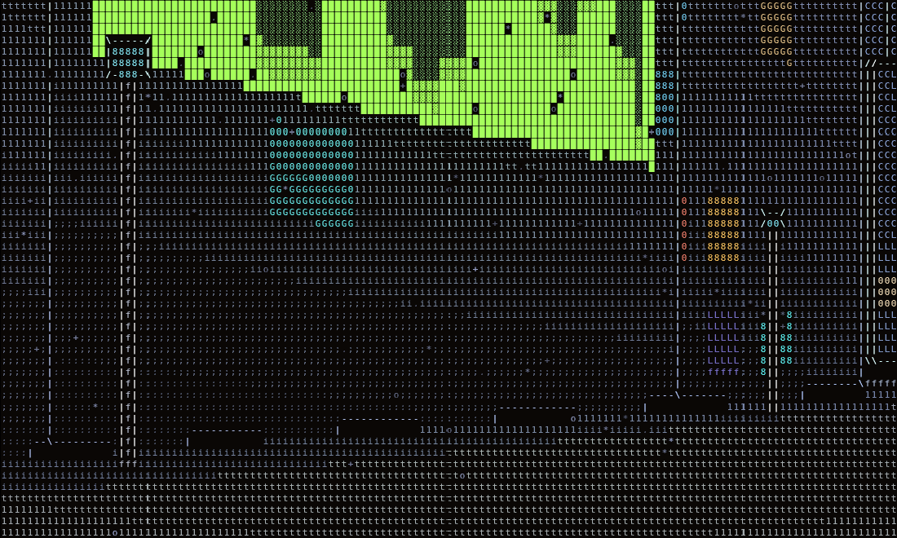

O clima alterna entre **limpo, chuva, neve e tempestade** em trechos
determinísticos, com rampa de transição. As gotas ficam num cilindro em
coordenada de mundo e são projetadas como qualquer sprite, passando pelo
z-buffer — ganham paralaxe e perspectiva de graça. A densidade é baixa de
propósito: molha a cena sem sujar a leitura do texto. O asfalto molhado escurece
e reflete mais, o que acende as poças sob os postes, e a tempestade tem
relâmpago que clareia o céu e a chuva por um instante.

## Subir nos prédios

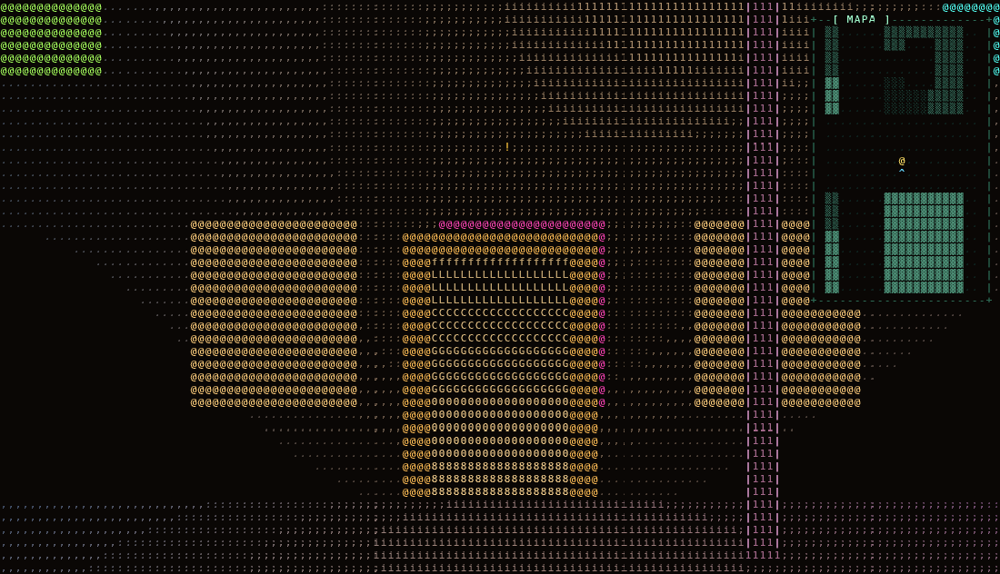

Todo prédio a partir de **24 m** ganha uma **porta** no meio de uma das
fachadas que dão para a rua — a mesma escolha de face que os outdoors usam, então
a porta nunca cai virada para o vizinho geminado. Ela é desenhada na própria
passagem da parede: moldura acesa nas bordas, saguão em degradê no miolo, e um
ponto de luz âmbar de 7 m de raio no batente, que à noite marca a entrada de
longe.

Uma **exclamação** flutua acima de cada porta, subindo e descendo devagar, e
dobra de brilho quando você entra no alcance de 3,4 m. Aí aparece o aviso
`[ E ] SUBIR AO TOPO` no rodapé — o único momento em que algo escrito aparece
na tela fora do menu.

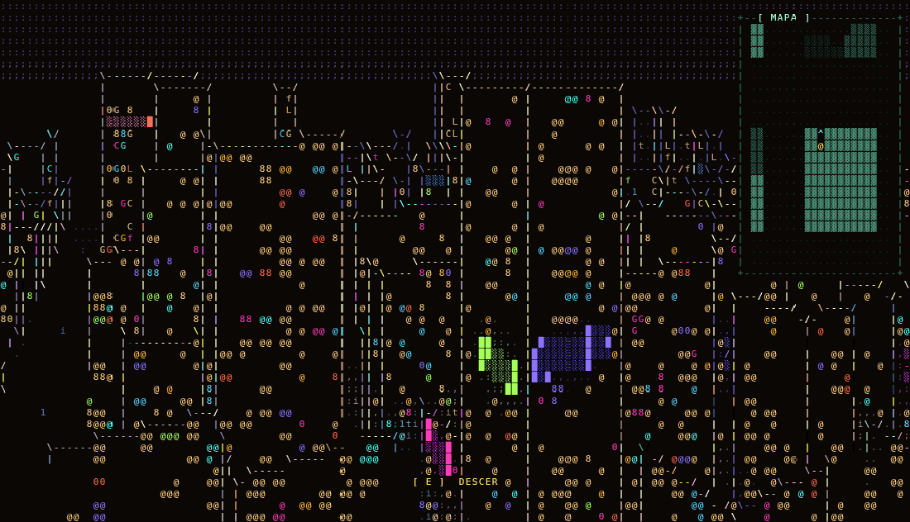

`E` teleporta para a laje, 3,2 m para dentro da fachada, e o telhado é chão como
qualquer outro: dá para andar nele, correr, andar de skate e pular. De
cima, com a barra de alcance aberta, a cidade vira um mar de lajes até a névoa.

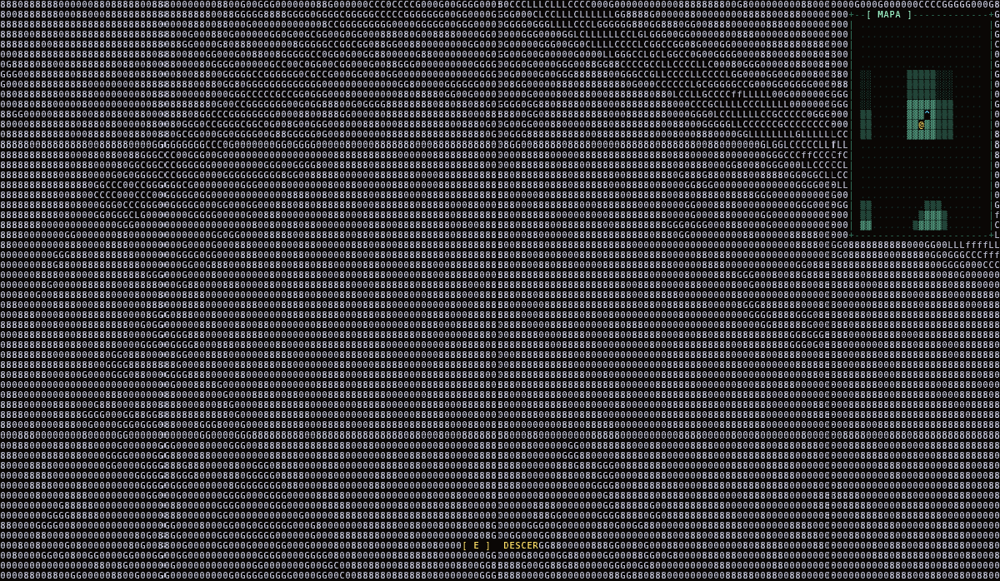

Para voltar há dois caminhos:

- **pular** — a queda é a física normal do jogo, e a colisão por altura vai
  parando em cada laje que estiver no caminho;
- **a mesma porta** — no ponto de saída da laje há uma segunda exclamação, e o
  `E` de lá devolve exatamente para a calçada de onde se entrou.

O marcador é um glifo só, e um glifo só era exatamente o que o passe de
contornos apagava: uma célula isolada mais perto que as quatro vizinhas tem
descontinuidade nos quatro lados, e virava `\`. As células de marcador e de
baliza agora são fixadas num mapa de bits que o contorno pula.

## Som

Seis peças, em `assets/sounds/`, e **nenhuma liga ou desliga**: cada camada tem
um alvo de volume recalculado a cada quadro a partir da própria fonte, e
persegue esse alvo com uma constante de tempo — sem isso toda mudança de estado
viraria um estalo.

| som | quando | o volume vem de |
|---|---|---|
| carro passando | um carro entra em 20 m | `(1 − d/20)²`, seguindo o carro enquanto toca |
| gente conversando | o dia todo, mais forte quando a cidade enche | densidade do horário × quanta gente há a menos de 34 m |
| chuva com trovão ao longe | chovendo | `ENV.fall`, mais forte na tempestade |
| trovão e rodovia | chovendo | idem — as duas peças se revezam, uma por trecho de clima |
| ambiente natural | amanhecer | sino em volta do nascer do sol, abafado se estiver chovendo |
| vento | em cima de um prédio | altura do jogador, de 9 m a 39 m |

Medido: o carro sai de 0 a 20 m, passa por 0,07 → 0,27 → 0,54 e chega a 0,68 ao
lado do jogador, caindo simétrico depois. A conversa vai de 0,05 de madrugada a
0,32 de manhã, 1,00 à tarde e 0,60 à noite — a mesma curva da densidade de
pedestres. E o vento é zero na calçada.

O menu tem uma seção **SOM** com liga/desliga e barra de volume.

**Nada de Web Audio, de propósito.** O jogo é um arquivo só, que se abre com
duplo clique — e abrir do disco faz o navegador tratar o mp3 como origem opaca,
o que faz um `MediaElementSource` ligado a ele tocar em silêncio. Com `<audio>`
puro e `.volume` o som funciona servido por HTTP e pelo disco, e volume é
justamente o que precisa ser dinâmico. O que se perde é o *pan* estéreo do
carro; a rampa de volume faz quase todo o trabalho sozinha. O navegador também
só libera áudio depois de um gesto, então o clique que entra na cidade destrava
as peças com um play mudo.

## O skate


`K` pega e larga o skate. É **um pouco** mais rápido que correr — 13,6 m/s
contra 11,0 m/s, cerca de 24 % — mas o que muda de verdade é a inércia:

- demora a pegar velocidade e quase não perde sozinho: soltando o `W` você
  desliza por bem mais tempo do que a pé;
- `A` e `D` **fazem curva**, não caranguejo: empurram com 45 % da força, e a
  velocidade gira junto com o olhar sem perder módulo — é o que separa carve de
  patinar no gelo;
- `S` é freio: para, não dá ré;
- ao descer, o excesso de velocidade é cortado para a velocidade de corrida.

O shape aparece em primeira pessoa e **recebe a luz da rua como qualquer outra
superfície** — passa embaixo de um poste e acende junto. A remada levanta a
câmera e o shape uma linha, no ritmo do empurrão.

## Ajustes

Tudo em `CFG` (traçado urbano) e `TUNE` (mapeamento de luminância). Os quatro
conjuntos de caracteres e seis tamanhos de célula trocam em tempo real:


## Próximos passos

- interiores de verdade (hoje a porta teleporta)
- pan estéreo dos sons, que pede servir por HTTP em vez de abrir do disco
- manobras no skate (hoje só rola e freia)
- áudio e controles de toque
- ruas em diagonal / avenidas (hoje a malha é estritamente ortogonal)

## Histórico

A v1 usava WebGL2 com MRT, Sobel em luminância + normais, e composição de glifos
num shader — a técnica de "graphics to text" popularizada pelo Acerola. Está no
histórico do git, em `178d2b8`.

## Créditos

- Ideia central: ASCII CITY Prototype 1, Grow Now! Games —
  <https://ko-fi.com/s/e1e0f91951>
- Arte ASCII dos painéis: <https://ascii.co.uk/art>, mantida com a assinatura
  de quem a fez (lmg, anubis, mark, sk, ejm, jgs)
- Carros: <https://ascii.co.uk/art/car> (ind, Lester, PS) — a assinatura foi
  recortada do sprite porque ficaria flutuando ao lado do veículo em movimento
- Sons: peças de `freesound.org`, nos nomes de arquivo em `assets/sounds/` —
  tanweraman (carro), perymarques (conversa), solarmusic (chuva com trovão),
  alex_jauk (trovão e rodovia), freesound_community (ambiente natural) e
  soundreality (vento)
- Pedestres: bonecos em traço feitos aqui. As peças pedidas em
  `asciiart.website` não puderam ser baixadas — o site responde 403 atrás de um
  CAPTCHA. A tabela `PED_ART` no começo da seção de gente e trânsito é só uma
  lista de peças com nome, janela de horário e cor: trocar por outras artes é
  editar essa tabela.
